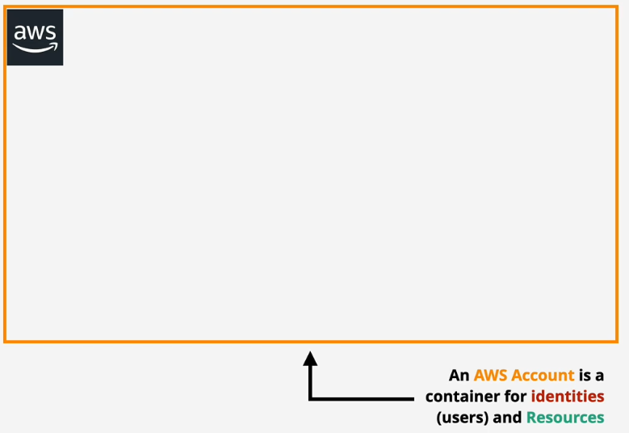

- [AWS Accounts](#aws-accounts)
  - [Account fundamentals](#account-fundamentals)
    - [What are they?](#what-are-they)
    - [What's needed to create one?](#whats-needed-to-create-one)
    - [Root User](#root-user)
    - [Bill Payment](#bill-payment)
    - [Security](#security)
    - [Blast Radius](#blast-radius)
    - [Wrapping up Account Fundamentals](#wrapping-up-account-fundamentals)

# AWS Accounts
## Account fundamentals
### What are they?
<b>Accounts are containers for identities (users) and Resources (services you provision)</b>

### What's needed to create one?
Three items required:
1. Account Name
2. Email (MUST be unique per account)
3. Credit Card (i.e. a payment method)
### Root User

<b>Each AWS Account has a unique Root User created upon instantiation</b>

 - Has FULL control over that one specific AWS Account and all associated Resources that reside in it
 - Cannot be restricted (i.e. have permissions modified/weakened)

`First pair of access keys MUST be created via console`

### Bill Payment
<b>AWS pioneers the `pay as you consume` model so Resources bill the AWS Account as they are used. Must attach a debit/credit card to Account upon instantiation</b>

### Security
<b>Identity and Access Management (IAM)</b>
 - Users
 - Group
 - Role

Each of these identity types start with NO permissions upon instantiaton and must be configured with either FULL or LIMITED permissions

`Example of a limited permission would be restricting User-JohnDoe to having just Read-Only access to a specific S3 Bucket. Whereas you might give User-DatabaseAdmin FULL accesss`

### Blast Radius
<b>Refers to the idea of limiting the impact of an adverse event such as:</b>
 - Accidental data deletion
 - rogue actor gains access to AWS account

Best practice is to separate out AWS Accounts as granularly as possible.

`Ex. Don't throw test/dev/prod stuff all in one AWS Account, instead separate them out by function, as I'm attempting`

### Wrapping up Account Fundamentals

----------
